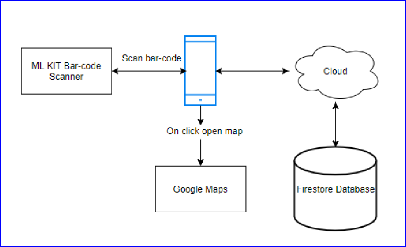
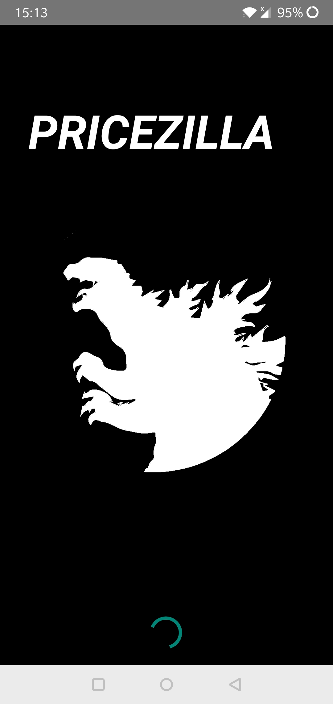
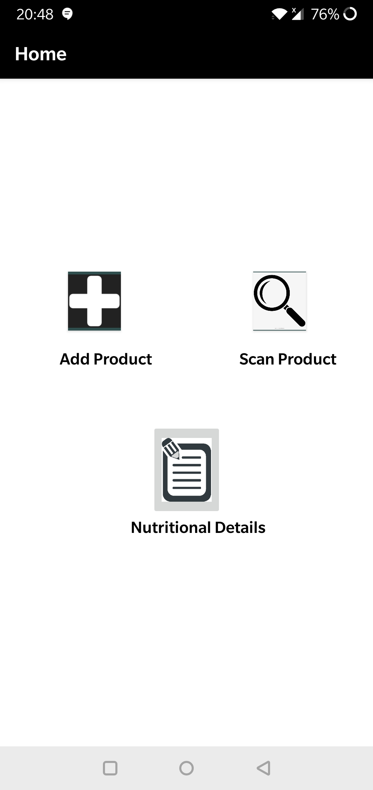
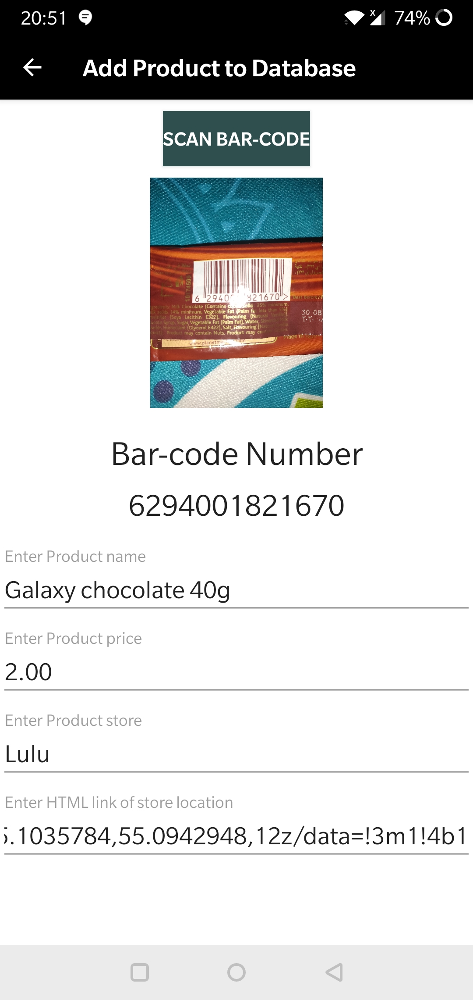
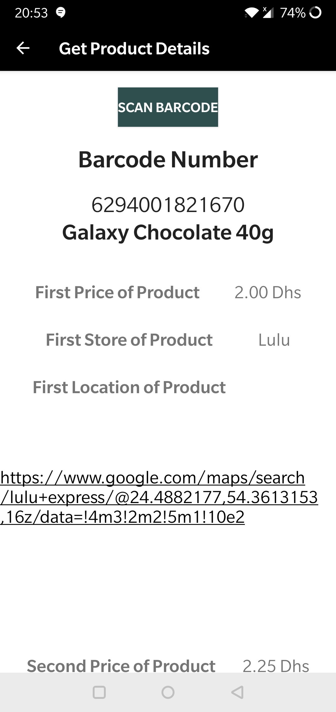
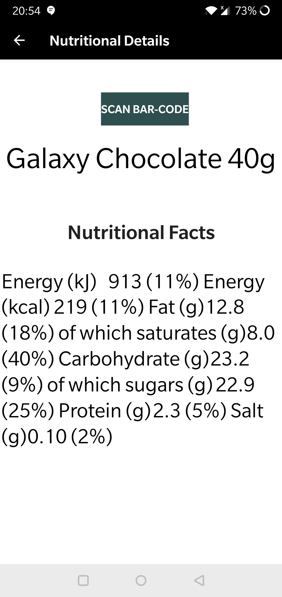

# 📱 Pricezilla – A Bar-code Based Price Comparison App

**A Final Year Individual Project**  
**Author:** Ayman Gundru
**Institution:** Middlesex University  
**Module:** CST3515 – Embedded Linux System and Application Development

---

## 📖 Overview

Pricezilla is a barcode-based price comparison Android app designed to help users compare product prices across local and supermarket retailers in the UAE. With integrated barcode scanning, Google Maps links, and nutritional info retrieval, it aims to empower budget-conscious consumers, students, the elderly, and the unemployed to make smarter, quicker, and more economical purchasing decisions.

---

## 🎯 Features

- 🔍 **Barcode Scanning** – Quickly scan product barcodes using the camera.
- 🏷️ **Price Comparison** – Instantly compare prices of products across multiple stores.
- 🗺️ **Store Locator** – Find the nearest store via integrated Google Maps links.
- 🧾 **Nutritional Info** – View nutritional facts for scanned food items.
- 📝 **Product Entry** – Users can manually add missing products to the database.
- 🔄 **Real-Time Database** – Powered by Firebase Firestore for live updates and data retrieval.

---

## 💡 Motivation

Consumers often overpay due to lack of access to real-time price data across various stores. Most existing apps do not:

- Cover local UAE grocery stores
- Offer barcode scanning for localized products
- Enable adding new product data
- Provide intuitive navigation or design

**Pricezilla** bridges this gap with a localized and user-friendly solution.

---

## 🛠️ Tech Stack

| Category           | Tools & Libraries                        |
|--------------------|------------------------------------------|
| Platform           | Android (Java, XML via Android Studio)   |
| Backend/Database   | Firebase Firestore (Real-time DB)        |
| Barcode Processing | Firebase ML Kit Vision                   |
| UI Design          | draw.io for mockups, XML for layout      |
| IDE                | Android Studio                           |

---

## 🗂️ Project Structure
```
├── barcoede_app/
│ ├── src/
│ │ ├── main/
│ │ │ ├── java/
│ │ │ │ ├── com/
│ │ │ │ │ └── pricezilla/
│ │ │ │ ├── MainActivity.java
│ │ │ │ ├── Product.java
│ │ │ │ ├── Details.java
│ │ │ │ ├── ProductUtil.java
│ │ │ │ ├── ProductBaseActivity.java
│ │ │ │ ├── ProductAdditionActivity.java
│ │ │ │ ├── ProductReaderActivity.java
│ │ │ │ ├── ProductDetails.java
│ │ │ │ └── SplashActivity.java
│ │ │ └── res/
│ │ │ ├── layout/
│ │ │ │ ├── activity_main.xml
│ │ │ │ ├── product_addition.xml
│ │ │ │ ├── product_reader.xml
│ │ │ │ ├── product_details.xml
│ │ │ │ └── splash_activity.xml
│ │ │ └── drawable/ (images/icons)
│ ├── build.gradle
│
├── docs/
│ ├── Individual project report.docx
│ ├── FYPppt.pptx
│
├── images/
│
├── LICENSE
└── README.md 
```

## 🖥️ App Architecture



- App scans barcodes via camera and Firebase ML Kit
- Barcode number is used to query product info in Firestore
- Results (price, stores, nutritional facts) are shown in-app
- Google Maps links assist in store navigation

---

## 📸 Screenshots

### 🖼️ Splash Screen


##

### 🏠 Home Page


##

### ➕ Add Product Page


##

### 🔍 Product Lookup


##

### 🍎 Nutrition Info Viewer


---

## ✅ Testing

### 🔍 White Box Testing

All methods (e.g., `onCreate()`, `getProductfromDB()`) successfully passed logic and integration tests.

### 🧪 Black Box Testing

All user-level functions such as scanning, adding, retrieving, and displaying nutritional info passed functionality tests.

### 🧑‍💻 Usability Evaluation

A user survey revealed:

- ✔️ High satisfaction with simplicity and barcode functionality  
- 🎨 Design aesthetics (colors/layout) could be improved

---

## 🚧 Limitations

- 📷 Scanning requires clear lighting and angles  
- 🛑 Duplicate entries are not flagged  
- 🔠 Search is barcode-only (no product-name search)  
- 🗺️ Basic store distance integration via Google Maps (no in-app routing)

---

## 🚀 Future Improvements

- 🔎 Add keyword/product name search  
- 🗺️ Embed Google Maps with route functionality  
- 📥 Allow saving product lists (wishlists/favorites)  
- 🔔 Implement price alerts  
- 🧑‍🤝‍🧑 Integrate a user feedback and rating system

---

## 📄 License

This project was developed as part of an academic submission. Please contact the author for use beyond personal or educational purposes.

---

## 📬 Contact

For inquiries or collaboration:

- 📧 Email: [aymanggv@hotmail.com]  
